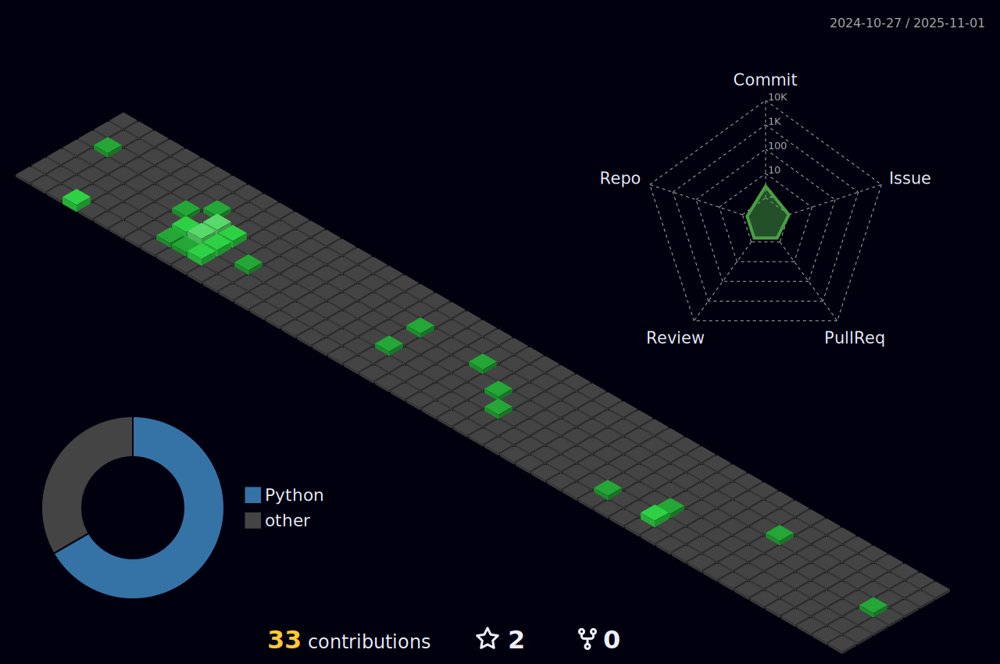

<h1 align="center">As-Salamu Alaykum 👋, I'm Zaeem Muhammad Yaseen</h1>
<h3 align="center">🔥 Python Developer Extraordinaire: Creating Scalable Applications with a Passion! from PAKISTAN 🔥</h3>

  

- 🏫 I’m currently studying **BS Computer Science**

- 🌱 I’m currently learning **Django, Flask, Machine Learning**

- ⚒️ I’m currently working on **Oasis Learning (FYP Project)**

- 👨‍💻 All of my projects are available at [https://github.com/ZaeemYaseen?tab=repositories](https://github.com/ZaeemYaseen?tab=repositories)

- 💬 Ask me about **C++, python, Data Structures, Design Algorithm**

- 📫 How to reach me **zaeem.m.yaseen@gmail.com**

<h3 align="left">Connect with me:</h3>

<h3 align="left">Languages and Tools:</h3>

              

